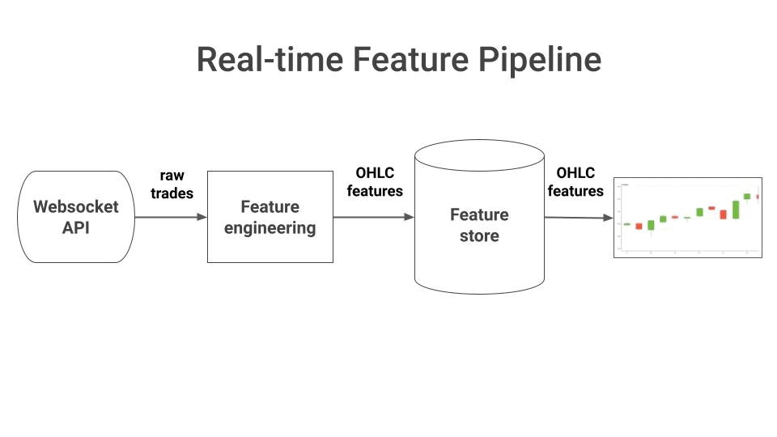
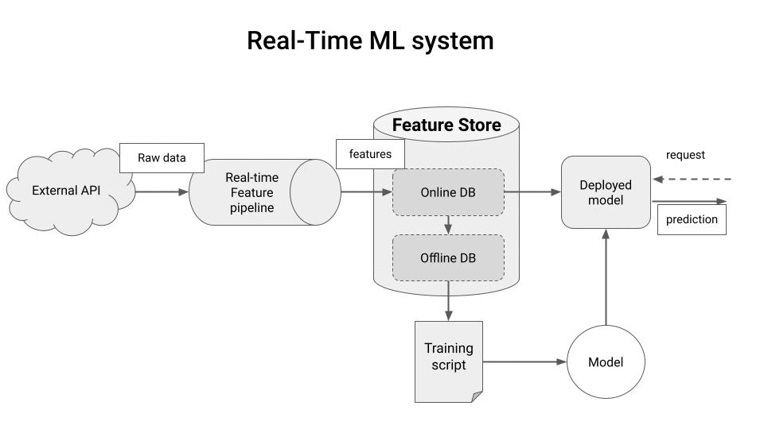

<div align="center">
    <h2>Hands-on MLOps</h2>
    <h1>Build and Deploy a Real-Time Feature Pipeline</h1>
    <h2>with Python 🐍⚡</h2>
    <!-- <i>by Pau Labarta Bajo</i> -->
    <!-- <i><a href="">Bytewax</a></i> + <i><a href="">Hopsworks</a></i> = 🚀 -->
</div>

<!-- <div align="center">
    <sub>Let's connect 🤗</sub>
    <br />
    <a href="https://twitter.com/paulabartabajo_">Twitter</a> •
    <a href="https://www.linkedin.com/in/pau-labarta-bajo-4432074b/">LinkedIn</a> •
    <a href="https://paulabartabajo.substack.com/">Newsletter</a>
<br />

</div> -->

<br>

<p align="center">
  
</p>

#### Table of contents
* [What is a real-time feature pipeline?](#what-is-a-real-time-feature-pipeline)
* [What is this repo about?](#what-is-this-repo-about)
* [Run the whole thing in 10 minutes](#run-the-whole-thing-in-10-minutes)
* [Wanna learn more real-time ML?](#wanna-learn-more-real-time-ml)

## What is a real-time feature pipeline?

Machine Learning models are as good as the input features you feed at training and inference time.

And for many real-world applications, like financial trading, these features must be generated and served **as fast as possible**, so the ML system produces the best predictions possible.

Generating and serving features fast is what a **real-time feature pipeline** does.

<p align="center">
  
</p>


Python alone is not a language designed for speed, which makes it unsuitable for real-time processing. Because of this, real-time feature pipelines were usually writen with Java-based tools (like Apache Spark or Apache Flink).

However, things are changing fast with the emergence of Rust and libraries like **[Bytewax](https://bytewax.io/?utm_source=pau&utm_medium=partner&utm_content=github)** that expose a pure Python API on top of a highly-efficient language like Rust.

So you can develop highly peformant and scalable real-time pipelines in Python 🐍⚡

<br>

## What is this repo about?

In this repository you will learn how to develop and deploy a real-time feature pipeline in 100% Python that

* **fetches** real-time trade data (aka raw data) from the [Coinbase Websocket API](https://help.coinbase.com/en/cloud/websocket-feeds/exchange)
* **transforms** trade data into OHLC data (aka features) in real-time using **[Bytewax](https://bytewax.io/?utm_source=pau&utm_medium=partner&utm_content=github)**, and
* **stores** these features in the [Hopsworks]() Feature Store

You will also build a dashboard using Bokeh and Streamlit to visualize the final features, in real-time.

<br>

## Run the whole thing in 10 minutes

1. Create a Python virtual environment with the project dependencies with
    ```
    $ make init
    ```

2. Set your Hopsworks API key and project name variables in `set_environment_variables_template.sh`, rename the file and run it (sign up for free at [hospworks.ai](https://app.hopsworks.ai/?utm_source=pau&utm_medium=pau&utm_content=github) to get these 2 values)
    ```
    $ . ./set_environment_variables.sh
    ```

3. To run the feature pipeline locally
    ```
    $ make run
    ```

4. To spin up a Streamlit dashboard to visualize the data in real-time
    ```
    $ make frontend
    ```

5. To run the feature pipeline on an AWS EC2 instance you first need to have an AWS account and the `aws-cli` tool installed in your local system. Then run the following command to deploy your feature pipeline onto an EC2 instance
    ```
    $ make deploy
    ```

6. Feature pipeline logs are send to AWS CloudWatch. Run the following command to grab the URL where you can see the logs.
    ```
    $ make info
    ```

7. To shutdown the feature pipeline on AWS and free resources run
    ```
    $ make undeploy
    ```

<br>

<!-- ## Deployment options

There are at least 3 ways to deploy your flows to production.

1. **Deployment to an AWS EC2 instance**
In this repository we use Bytewax as our stream-processing engine and the [`waxctl`](https://bytewax.io/>docs/deployment/waxctl-aws) command line tool to deploy our dataflow to EC2. EC2 instances are enough for a proof-of-concept, but they are not the best way to scale your systems when you grow.

2. **Deployment to a Kubernetes cluster**
If you want to deploy the pipeline to a Kubernetes cluster, you will need to adjust the arguments passed to `waxctl` in the `Makefile`. Check the documentation [here](https://bytewax.io/docs/deployment/waxctl) to learn how.

3. **Deployment to the Bytewax Platform** (serverless)
If you want to add real-time processing to your systems without worrying about extra infrastructure, check out the [Bytewax Platform](https://bytewax.io/platform). -->

## Wanna learn more Real-Time ML?

I am preparing a new hands-on tutorial where you will learn to buld a complete real-time ML system, from A to Z.

**[➡️ Subscribe to The Real-World ML Newsletter](https://paulabartabajo.substack.com/)** to be notified when the tutorial is out.

